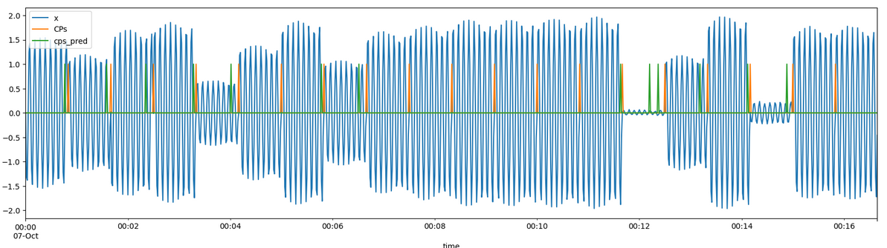

# Time-Series Change Point Detection models for Oil and Gas Industries.

#### version: 0.0.1
- Syth data generator as well as real data available at data dir.
- Refactored models based on KalmanFilter and Singular Value Decomposition technique avalable at model dir.
- Custom fast optimization based on heuristics methods.
- Streamlit example app at examples dir.

#### Notes:
 - Most of the implemented idea/code based on my master thesis. SingularSequenceTransformation and WindowSizeSearch 
optimization 
classes has been refactored based on implementations from ***Fedot.Industrial*** legacy.
 - To score change point detection models functions from ***TSAD*** lib has been used\adopted.

## To set up local project dependencies:
```commandline
    python3 setup.py build
```

## Example API usage:

#### №1 SingularSequenceTransformer
```Python3
# init libs
from models.SubspaceBased import SingularSequenceTransformer
from data.SythData import SinusoidWaves
from utils.Reports import SummaryReport

# init df
data = SinusoidWaves(length_data=1000,
                     cps_number=20,
                     white_noise_level="min").get()

# extract target array
target_array = data['x'].values

#define some hyperparameters apriori.
model = SingularSequenceTransformer(
        queue_window=10,
        n_components=2,
        is_fast_parameter_selection=True,
        threshold_quantile_coeff=0.95).fit(x_train=list(target_array), y_train=None)

# predict change points at target_array
cps_pred = model.predict(target_array=target_array)

# save all results at one dataframe
data['cps_pred'] = cps_pred

# plot results
data.plot(figsize=(20,5))

# get scores based on initial dataframe and model results
df_summary_report = SummaryReport().create_report(df=data,
                              column_name_preds="cps_pred",
                              column_name_original="CPs"
                              )
```


TO DO:

1. Docker images to reproduce examples.
2. CPD significant checker based on queue distance algorithm and statistical information for each subsequcnes.
3. Hybrid model based on master thesis.
4. Some more optimization hyperparameters algorithms.
5. default notebook examples for each model.
6. FastAPI service for end-to-end use in container.
7. Advanced change point detection models based on 
8. More tests.

[//]: # (Here you find notebooks with Change Point Detection methods in Petroleum Data. Mainly I focus to experiment with Fedot.Industrial library.)

[//]: # ()
[//]: # (My point is to create an offline CPD algorithm:)

[//]: # ()
[//]: # (  1. Without a priori knowledge of CPs numbers in data.)

[//]: # (  )
[//]: # (  2. With auto-selected parameters.)

[//]: # (  )
[//]: # (  3. Minimum FPs detection.)

[//]: # (  )
[//]: # (  4. Minimum time delta detection.)

[//]: # (  )
[//]: # (  5. Maximum CPs detection.)

[//]: # (  )
[//]: # (  )
[//]: # (in progress...)

[//]: # ()
[//]: # (TO DO list:)

[//]: # ()
[//]: # (1. Refactoring && Restructure dir)

[//]: # (2. Update SST and Kalman Filter models)

[//]: # (3. Update streamlit app)

[//]: # (4. Create Docker Image && CI)

[//]: # (5. Add some tests for models)
